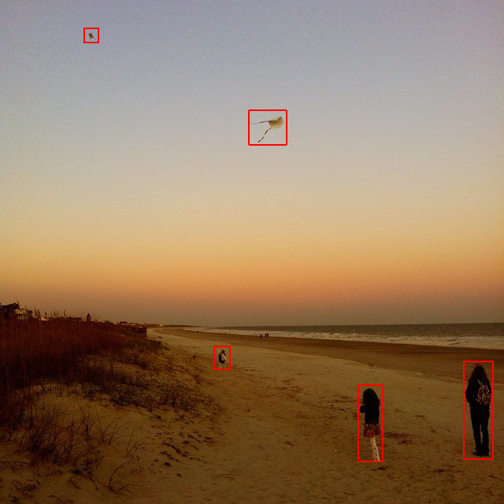

# MPiMS_NN_on_NVidia_Jetson
 Projekt na zaliczenie przedmiotu MPiMS

Repozytorium zawiera kod pozwalający na rozpoznanie obiektów znajdujących się na obrazie.

## Użycie
```
./NeuralNetworkDetection <path/to/saved_model> <path/to/image.jpg> <path/to/output.jpg>
```

## Obraz wyjściowy

> Źródło: Dataset COCO - https://cocodataset.org/#explore?id=250067